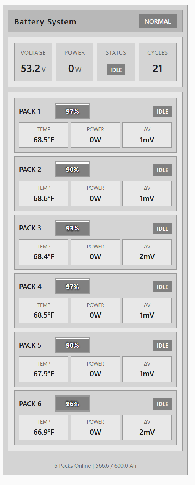

# Pylontech Battery Card

A comprehensive Lovelace card for monitoring Pylontech (SOK) BMS battery systems in Home Assistant, designed according to **ISA-101 Human Machine Interface standards** for optimal readability and situational awareness. Works with entities created by the [Pylontech BMS Integration](https://github.com/jtubb/HA-Pylontech-BMS) but should work with any that follow similar naming conventions.



## Features

- **ISA-101 Compliant Design** - Industrial HMI color standards for clear status indication
- **System Overview** - Total voltage, power, average cycles, and time to empty/full estimates
- **Multi-Pack Monitoring** - Display 1-16+ battery packs in a responsive grid layout
- **Interactive Heatmaps** - Click temperature or voltage labels to view cell-level heatmaps
- **History Graphs** - Click any metric to view historical data powered by mini-graph-card
- **Configurable Thresholds** - Set custom warning/alarm levels for SOC, temperature, and delta-V
- **Real-time Updates** - Live monitoring with visual SOC indicators and status colors
- **Responsive Design** - Optimized layouts for desktop, tablet, and mobile devices
- **Pack Metrics** - Voltage, current, power, delta V, and temperature for each pack
- **Visual Alerts** - Color-coded warnings using ISA-101 status indicators


## Requirements

- Home Assistant 2024.1.0 or newer
- [Pylontech BMS Integration](https://github.com/jtubb/HA-Pylontech-BMS) installed and configured
- [mini-graph-card](https://github.com/kalkih/mini-graph-card) (required for history graphs)

## Installation

### HACS (Recommended)

1. Open HACS in Home Assistant
2. Go to "Frontend"
3. Click the three dots in the top right corner
4. Select "Custom repositories"
5. Add this repository URL: `https://github.com/jtubb/pylontech-battery-card`
6. Select category: "Lovelace"
7. Click "Add"
8. Find "Pylontech Battery Card" in the list and click "Install"
9. Install [mini-graph-card](https://github.com/kalkih/mini-graph-card) from HACS
10. **Add the resource** (see below - this is required!)
11. Clear your browser cache (Ctrl+Shift+R or Cmd+Shift+R)
12. Restart Home Assistant

#### Add Resource After HACS Installation

**This step is required or you'll get "Custom element doesn't exist" error!**

**Method 1: Via UI (Recommended)**
1. Go to **Settings** → **Dashboards** → **Resources** (three-dot menu in top right)
2. Click **"Add Resource"**
3. URL: `/hacsfiles/pylontech-battery-card/pylontech-battery-overview.js`
4. Type: **JavaScript Module**
5. Click **"Create"**
6. Clear browser cache (Ctrl+Shift+R)

**Method 2: Via configuration.yaml**
```yaml
lovelace:
  resources:
    - url: /hacsfiles/pylontech-battery-card/pylontech-battery-overview.js
      type: module
```

### Manual Installation

1. Download `pylontech-battery-overview.js` from the [latest release](https://github.com/jtubb/pylontech-battery-card/releases)
2. Copy the file to `config/www/` directory
3. Install [mini-graph-card](https://github.com/kalkih/mini-graph-card) manually
4. Add to your Lovelace resources:
   ```yaml
   - url: /local/pylontech-battery-overview.js
     type: module
   - url: /local/mini-graph-card-bundle.js
     type: module
   ```
5. Restart Home Assistant

## Configuration

### Basic Configuration

```yaml
type: custom:pylontech-battery-overview
entity_prefix: sensor.sok_rack_1
pack_count: 5
```

### Full Configuration

```yaml
type: custom:pylontech-battery-overview
entity_prefix: sensor.sok_rack_1
pack_count: 5
start_index: 1
title: BATTERY SYSTEM
# ISA-101 Threshold Configuration
soc_warning: 30      # SOC % below which shows warning (amber)
soc_alarm: 15        # SOC % below which shows alarm (red)
temp_warning: 40     # Temperature °C above which shows warning
temp_alarm: 50       # Temperature °C above which shows alarm
delta_v_warning: 30  # Delta-V mV above which shows warning
delta_v_alarm: 50    # Delta-V mV above which shows alarm
```

### Configuration Options

| Option | Type | Default | Description |
|--------|------|---------|-------------|
| `entity_prefix` | string | **required** | Entity prefix for your battery system (e.g., `sensor.sok_rack_1`) |
| `pack_count` | number | `6` | Number of packs to display |
| `start_index` | number | `1` | Starting pack number to display |
| `title` | string | `BATTERY SYSTEM` | Card title |
| `soc_warning` | number | `30` | SOC % threshold for warning state (amber) |
| `soc_alarm` | number | `15` | SOC % threshold for alarm state (red) |
| `temp_warning` | number | `40` | Temperature °C threshold for warning |
| `temp_alarm` | number | `50` | Temperature °C threshold for alarm |
| `delta_v_warning` | number | `30` | Delta-V mV threshold for warning |
| `delta_v_alarm` | number | `50` | Delta-V mV threshold for alarm |

### Entity Naming Convention

The card expects entities to follow this naming pattern:
```
{entity_prefix}_pack_{N}_{metric}
```

Examples:
- `sensor.sok_rack_1_pack_1_pack_voltage`
- `sensor.sok_rack_1_pack_1_state_of_charge`
- `sensor.sok_rack_1_pack_1_temperature_cells_1_4`
- `sensor.sok_rack_1_pack_1_cell_0_voltage`

## Usage Examples

### Multiple Battery Packs

```yaml
type: custom:pylontech-battery-overview
entity_prefix: sensor.sok_rack_1
pack_count: 5
title: MAIN BATTERY SYSTEM
```

### Single Pack System

```yaml
type: custom:pylontech-battery-overview
entity_prefix: sensor.sok_rack_1
pack_count: 1
title: BATTERY PACK
```

### Large System (10+ Packs)

```yaml
type: custom:pylontech-battery-overview
entity_prefix: sensor.sok_rack_1
pack_count: 16
title: LARGE BATTERY SYSTEM
```

### Multiple Battery Systems

```yaml
type: vertical-stack
cards:
  - type: custom:pylontech-battery-overview
    entity_prefix: sensor.sok_rack_1
    pack_count: 5
    title: RACK 1 - MAIN SYSTEM

  - type: custom:pylontech-battery-overview
    entity_prefix: sensor.sok_rack_2
    pack_count: 3
    title: RACK 2 - BACKUP SYSTEM
```

### Custom Thresholds for High-Performance Systems

```yaml
type: custom:pylontech-battery-overview
entity_prefix: sensor.sok_rack_1
pack_count: 6
title: HIGH PERFORMANCE SYSTEM
soc_warning: 25
soc_alarm: 10
temp_warning: 35
temp_alarm: 45
delta_v_warning: 20
delta_v_alarm: 40
```

## Interactive Features

### Heatmaps
- **Temperature Heatmap**: Click the "Temperature" label in any pack card to view cell temperature distribution
- **Voltage Heatmap**: Click the "Delta V" label to view cell voltage distribution
- **Cell History**: Click any individual cell in the heatmap to view its history graph

### History Graphs
- Click any system metric (voltage, power, cycles, etc.) to view its history
- Click any pack metric to view that pack's history
- Zoom controls: 1h, 3h, 6h, 12h, 24h intervals
- Powered by mini-graph-card for smooth, interactive graphs

## Visual Indicators

### ISA-101 Status Colors

The card follows ISA-101 Human Machine Interface standards for status indication:

| Status | Color | Meaning |
|--------|-------|---------|
| **Normal** | Gray (#808080) | Operating within normal parameters |
| **Abnormal** | Blue (#0088cc) | Deviation from normal, attention needed |
| **Warning** | Amber (#cc8800) | Approaching limits, action recommended |
| **Alarm** | Red (#cc0000) | Critical condition, immediate action required |

### State of Charge (SOC) Indicators
- **Red** (below `soc_alarm`): Critical - immediate attention required
- **Amber** (below `soc_warning`): Warning - charge recommended
- **Gray** (normal): Operating normally

### Temperature & Delta-V Indicators
- Values are color-coded based on configured thresholds
- Configurable warning and alarm levels per system requirements

### Pack Status
- **Red header**: Pack has active alarms or critical conditions
- **Amber header**: Pack requires attention
- **Gray header**: Pack operating normally

### Heatmap Colors
- **Cool (blue)**: Lower values
- **Neutral (green/yellow)**: Mid-range values
- **Hot (red)**: Higher values approaching limits

## Troubleshooting

### "Custom element doesn't exist" Error

**This is the most common issue after HACS installation.**

The JavaScript file hasn't been loaded as a resource.

**Solution:**
1. Go to **Settings** → **Dashboards** → **Resources** (click three dots in top right)
2. Verify resource is added: `/hacsfiles/pylontech-battery-card/pylontech-battery-overview.js`
3. If missing, click "Add Resource" and add it (Type: JavaScript Module)
4. Clear browser cache (Ctrl+Shift+R or Cmd+Shift+R)
5. Refresh the page

**Verify files exist:**
```bash
ls /config/www/community/pylontech-battery-card/
```
You should see `pylontech-battery-overview.js`. If missing, reinstall from HACS.

### Card Not Showing

1. Verify the Pylontech BMS integration is installed and working
2. Check sensors exist in **Developer Tools** → **States**
3. Verify mini-graph-card is installed from HACS
4. Clear browser cache (Ctrl+Shift+R or Cmd+Shift+R)
5. Check browser console for errors (F12 → Console tab)
6. Verify the resource is loaded (see above)

### Entity Not Found

1. Check entity prefix is correct (e.g., `sensor.sok_rack_1`)
2. Verify entities exist in **Developer Tools** → **States**
3. Check pack numbering matches your actual packs
4. Ensure entities follow the naming pattern: `{prefix}_pack_{N}_{metric}`

### History Graphs Not Working

1. Ensure mini-graph-card is installed from HACS
2. Verify mini-graph-card is in Lovelace resources
3. Check browser console for errors (F12)
4. Verify entities have recorded history data in Home Assistant

### Heatmap Not Displaying

1. Verify cell entities exist (e.g., `sensor.sok_rack_1_pack_1_cell_0_voltage`)
2. Check entity naming follows the expected pattern
3. Ensure entities have valid numeric values
4. Check browser console for errors

### Slow Performance

1. Reduce number of packs displayed (split into multiple cards)
2. Disable heatmaps by not clicking labels
3. Check Home Assistant system resources
4. Verify network connection is stable

## Development

### Local Development

1. Clone the repository
2. Make changes to `pylontech-battery-overview.js`
3. Copy to `config/www/` for testing
4. Refresh browser cache to see changes

### Building

This card is written in vanilla JavaScript and doesn't require a build step. Simply edit the `.js` file directly.

### Testing

Test on multiple screen sizes:
- Desktop (1920x1080)
- Tablet (768x1024)
- Mobile (375x667)

## Support

- **Issues**: [GitHub Issues](https://github.com/jtubb/pylontech-battery-card/issues)
- **Integration**: [Pylontech BMS Integration](https://github.com/jtubb/HA-Pylontech-BMS)
- **mini-graph-card**: [GitHub](https://github.com/kalkih/mini-graph-card)

## Contributing

Contributions are welcome! Please:

1. Fork the repository
2. Create a feature branch
3. Make your changes
4. Test on multiple screen sizes
5. Submit a pull request

## License

MIT License - see LICENSE file for details

## Credits

- Created for use with the [Pylontech BMS Integration](https://github.com/jtubb/HA-Pylontech-BMS)
- History graphs powered by [mini-graph-card](https://github.com/kalkih/mini-graph-card) by @kalkih

## Changelog

### Version 3.0.0
- **ISA-101 Redesign**: Complete rewrite following ISA-101 Human Machine Interface standards
- **Industrial Color Palette**: Neutral gray background with status-specific colors (gray/blue/amber/red)
- **Flat Design**: Removed gradients and shadows for cleaner industrial appearance
- **Configurable Thresholds**: User-configurable warning/alarm levels for SOC, temperature, and delta-V
- **Improved Readability**: High-contrast text and clear status indicators
- **Simplified Configuration**: Changed `end_index` to `pack_count` for easier setup
- **Enhanced Status Visualization**: Color-coded values based on ISA-101 status categories

### Version 2.1.0
- **Simplified**: Removed single-pack card, overview card now handles all use cases
- Improved documentation and troubleshooting guides
- Clearer HACS installation instructions
- Better example configurations

### Version 2.0.0
- Added Battery Overview Card for multi-pack system monitoring
- Integrated mini-graph-card for history visualization
- Added interactive temperature and voltage heatmaps
- Implemented responsive design for mobile and desktop
- Added system-level statistics (total power, cycles, time estimates)
